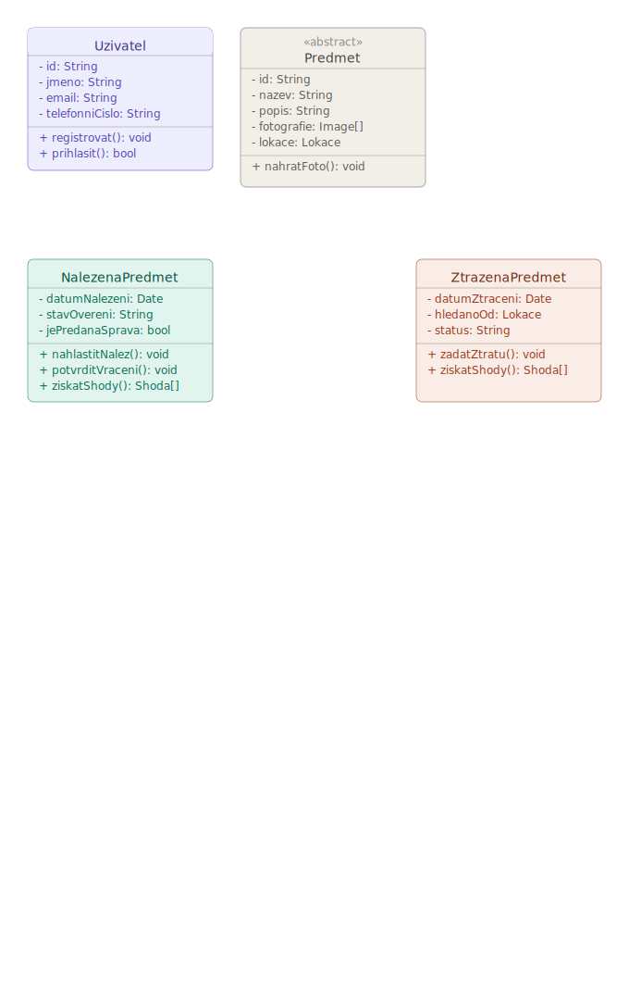
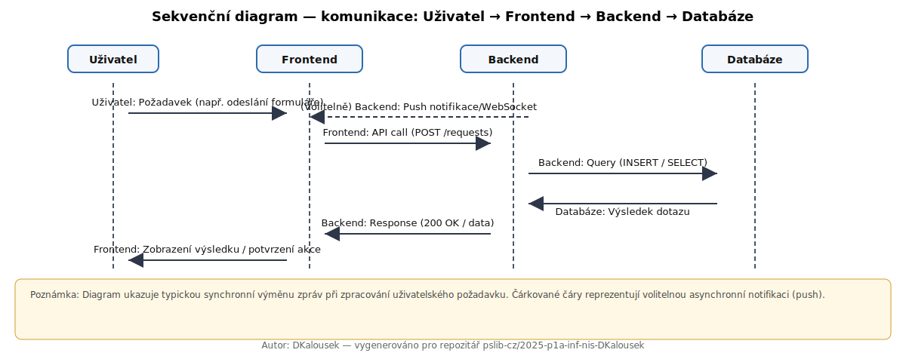

Digitální systém ztrát a nálezů je moderní platforma, která v reálném čase propojuje nálezce s majiteli ztracených věcí. Přes mobilní aplikaci stačí předmět jednoduše vyfotit [...]

## UML Use Case diagram

Níže je vložený UML Use Case diagram (barevný SVG):

Alternativně: [Stažení SVG Use Case](https://raw.githubusercontent.com/pslib-cz/2025-p1a-inf-nis-DKalousek/main/usecase-diagram.svg)

## UML Třídový diagram

Níže je vložen třídový diagram (UML class) znázorňující hlavní entity systému:

Alternativně: [Stažení SVG třídového diagramu](https://raw.githubusercontent.com/pslib-cz/2025-p1a-inf-nis-DKalousek/main/uml_class_diagram_ztrazy_a_nalezy.svg)

## Sekvenční diagram

Níže je vložen sekvenční diagram znázorňující komunikaci mezi uživatelem, frontendem, backendem a databází:

Alternativně: [Stažení SVG sekvenčního diagramu](https://raw.githubusercontent.com/pslib-cz/2025-p1a-inf-nis-DKalousek/main/sequence-diagram.svg)

Autor: DKalousek
